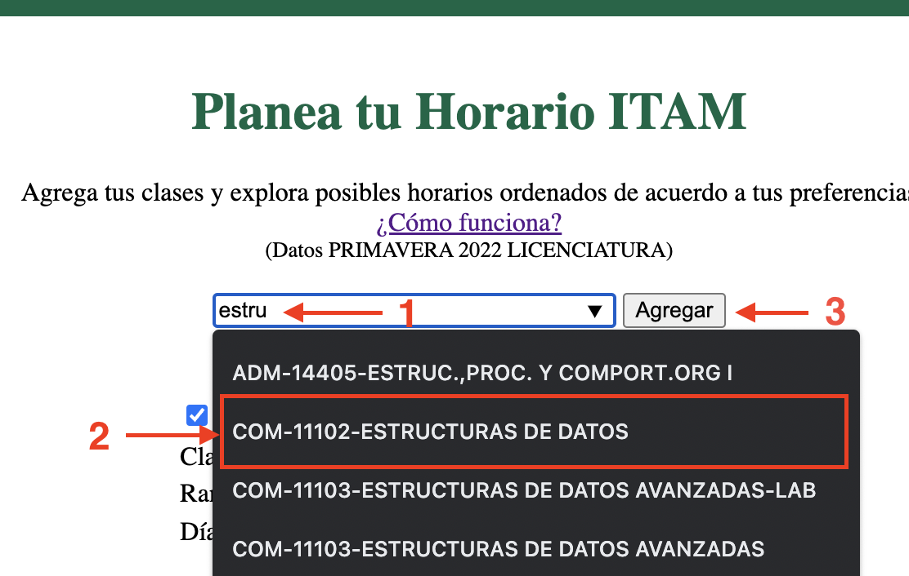
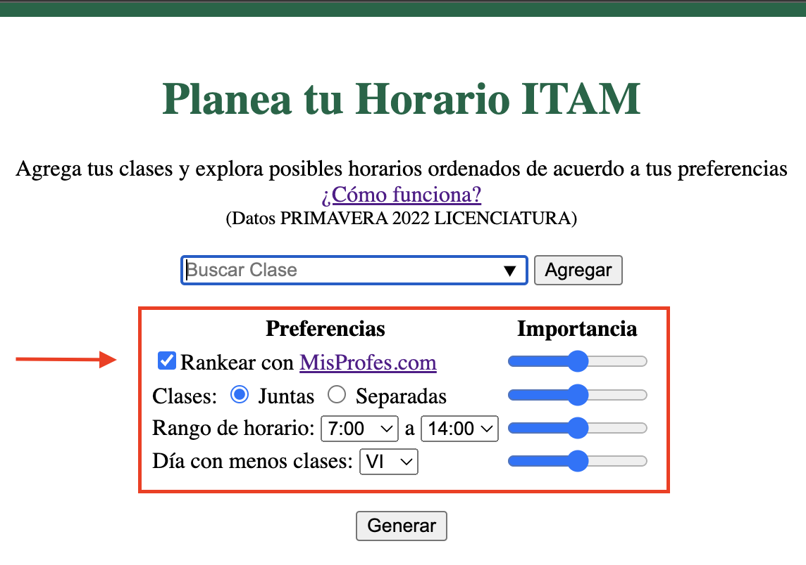
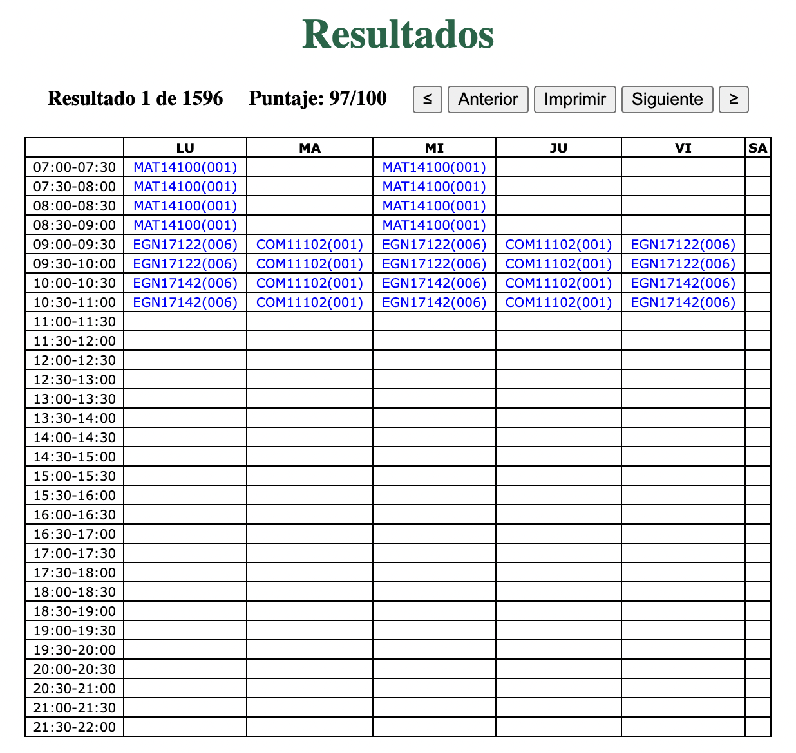
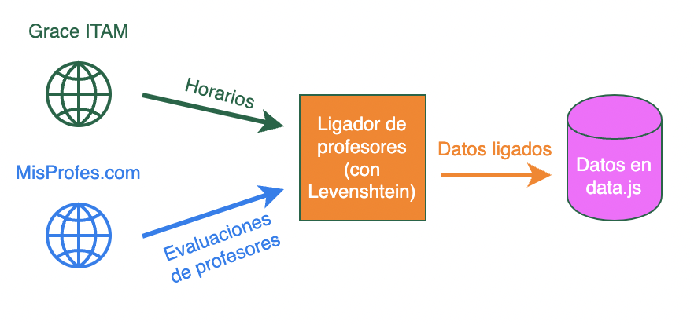

# Planea tu horario ITAM

Página web que le ayuda a estudiantes de licenciatura del ITAM a planear su horario.    
    
Estudiantes pueden ingresar las clases que desean cursar y después explorar todos los posibles horarios válidos (sin materias empalmadas) que se pueden formar. Para facilitar dicha exploración, se puede ingresar una lista de preferencias con las que se evalúan y ordenan los horarios tal que aquellos que mejor cumplan con ellas se muestran primero. 

El/la estudiante puede ingresar como preferencias, por ejemplo, 
- que sus profesores tengan evaluaciones altas (en MisProfes.com),
- que sus clases empiecen a partir de las 9 am todos los días y 
- que los días con menos clases sean los viernes.

## ¿Cómo se usa?
### Agrega tus clases

Sigue los pasos ilustrados a continuación para todas las clases que tengas planeadas cursar.

1. Comienza a escribir el nombre o clave de la clase en la barra “Buscar Clase”.
2. Selecciona la clase en el menú que se despliega.
3. Oprime el botón de “Agregar”.

Las clases agregadas se muestran en el apartado de “Clases seleccionadas” en la parte inferior de la página. Oprime el nombre de una clase para desplegar sus grupos y otra información relevante. 

En la primera columna, las casillas seleccionadas indican los grupos se tomarán en cuenta al generar los horarios. Si te gustaría incluir sólo algunos grupos puedes deseleccionar el resto. 

Si el perfil del profesor del grupo existe en MisProfes.com se despliega su calificación general y link al perfil a un lado de su nombre. 

Para consultar los horarios de la clase en la página de Grace del ITAM oprime “Ver en Horarios ITAM” y para eliminar la clase de la lista de clases seleccionadas oprime “Eliminar Clase”.

### Ingresa tus preferencias

Puedes ingresar tus preferencias en el panel ilustrado a continuación o saltarte este paso y proceder con las preferencias predeterminadas.

 

Las preferencias que puedes ingresar incluyen: 

- **Rankear con MisProfes.com.** Indica si tomar en cuenta las evaluaciones generales de profesores. Se le da preferencia a grupos con profesores que tienen mayor calificación y a aquellos que cuentan con perfil en la plataforma.
- **Clases Juntas o Separadas.** Indica el tiempo entre clases deseado. “Juntas” le da prioridad a horarios con pocas “horas muertas” y viceversa.
- **Rango de Horario.** Indica las horas del día entre las que te gustaría que cayeran todas tus materias. 
- **Día con menos clases.** Indica el día de la semana deseado con el menor número de clases posibles. 

Adicionalmente, puedes ajustar la importancia que se le da a cada preferencia con las barras deslizadoras a un lado de cada una, en la columna “Importancia”.

### Genera y explora tus horarios

Oprime el botón “Generar”. Se desplegará el panel de “Resultados” con tus horarios ordenados de acuerdo a tus preferencias.

 

En el panel se muestra cada uno de los horarios generados en un formato similar al usado en la página de Grace del ITAM.

Para navegar entre los horarios usa los botones “Anterior”, “Siguiente”, “≤” y “≥”. En la parte superior izquierda se muestra el número de horarios generados y el puntaje calculado asociado con tus preferencias. Adicionalmente puedes oprimir el botón de “Imprimir” para generar un PDF o imprimir el horario mostrado actualmente.

## Datos

La página usa datos que provienen del apartado de [“Servicios No Personalizados”](https://serviciosweb.itam.mx/EDSUP/BWZKSENP.P_MenuServNoPers) de Grace del ITAM y de la [sección dedicada a profesores del ITAM](https://www.misprofesores.com/escuelas/ITAM-Instituto-Tecnologico-Autonomo-de-Mexico_1003) en [MisProfes.com](https://www.misprofesores.com/). 

Como los nombres de profesores pueden ser ingresados de formas distintas en MisProfes y en Grace, se usa una [similitud de Levenshtein](https://en.wikipedia.org/wiki/Levenshtein_distance) de 90% para ligarle sus evaluaciones a cada profesor/a.

Los datos son actualizados cada semestre y una vez al día durante la semana de inscripciones.

