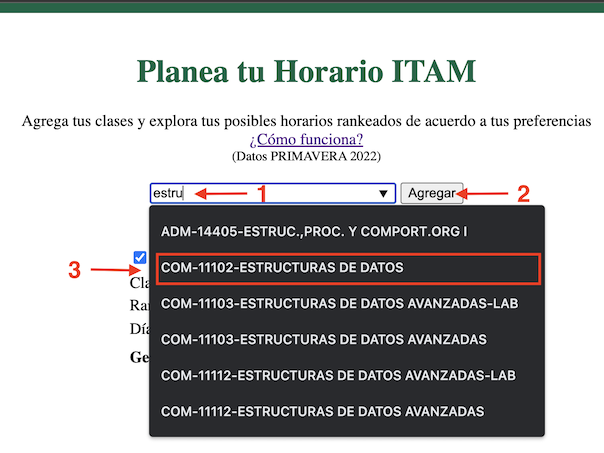
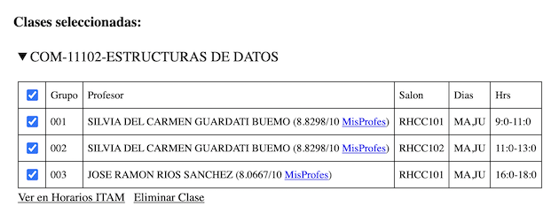
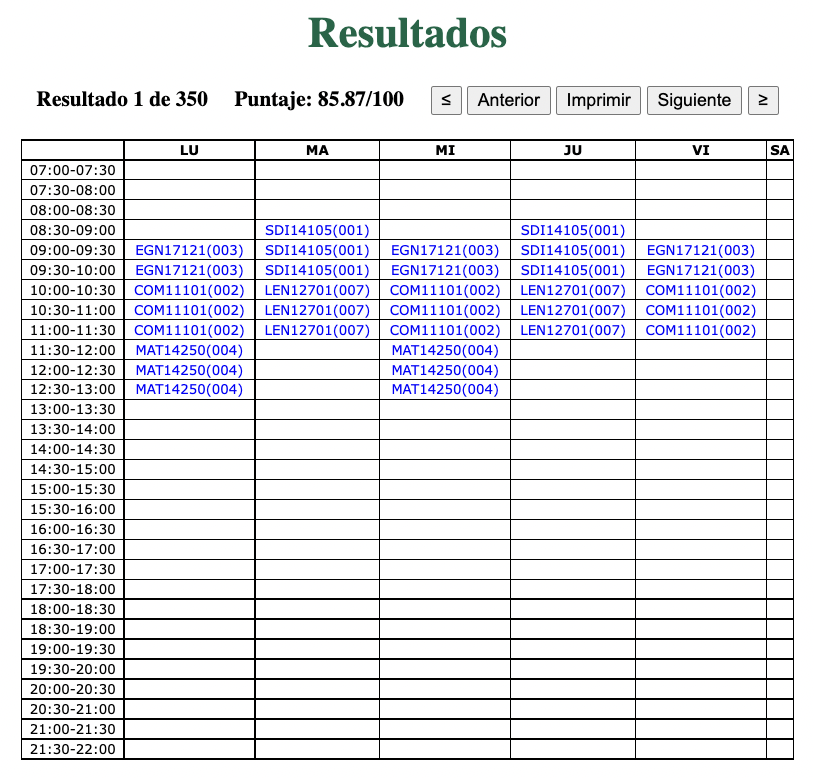

# Planea tu horario ITAM

Esta página web ayuda a estudiantes de licenciatura del ITAM a planear su horario.

La página permite ingresar las clases que se planea llevar en el semestre y una lista de preferencias (explicada abajo). Con estos datos se muestran los horarios donde las clases no se empalman ordenadas de acuerdo a la lista de preferencia.

La lista de preferencias captura el horario ideal del estudiante. En esta versión de la página el usuario puede ingresar el dia de la semana con menos clases, el rango del horario (cuando “empieza” y “termina” su día), el tiempo entre clases, y el incluir o no las calificaciones de los profesores obtenidas de MisProfes.com. 

## ¿Cómo se usa?
### 1. Agrega tus clases

Empieza a escribir el nombre o clave de la clase que quieres agregar en la barra con el texto “Buscar Clase” (1), selecciona la clase del menú que se despliega (2) y oprime el botón de “Agregar” (2). Repite para todas tus clases.

Al agregar una clase se agrega a la sección de “Clases seleccionadas” en la parte de abajo de la página. Al darle click en el nombre de una clase se despliegan los grupos e información relevante. 

Las casillas con [insertar palomitas] indican que ese grupo se tomará en los horarios generados. Si te gustaría excluir algunos grupos o incluir sólo algunos puedes seleccionarlos de esta forma. La casilla de arriba (cabezara?) selecciona y deselecciona todas las casillas. 

Si el perfil del profesor del grupo existe en MisProfes.com se despliega su calificación general y link al perfil a un lado de su nombre. 

Para consultar los horarios de la clase en la página de Grace del ITAM oprime “Ver en Horarios ITAM” y para eliminar la clase de la lista de clases seleccionadas oprime “Eliminar Clase”.

### 2. Ingresa tus preferencias

Para  encontrar el mejor horario para ti con las clases seleccionadas puedes ingresar una serie de preferencias que describen tu horario ideal. La página después desplegará los horarios más parecidos a este. También puedes optar por saltar este paso y proceder con las preferencias por defecto.

Las preferencias que puedes ingresar incluyen: [CHECAR TODOS LOS BULLETS]

- **Rankear con MisProfes.com** indica si se tomará en cuenta la calificación general de los profesores de los grupos en MisProfes.com. Se le dará preferencia a profesores con calificación más elevada y a aquellos que tienen ligados un perfil sobre los que no.
- **Clases Juntas o Separadas** indica el tiempo entre clases deseado. De seleccionar “Juntas” se le dará prioridad a horarios con pocas “horas muertas” y viceversa.
- **Rango de Horario** indica las horas del día entre las que te gustaría que cayeran todas tus materias. 
- **Día con menos clases** indica el día de la semana con el menor número de clases. 
Generar indica el método en el cual se generan los horarios en el siguiente paso. El predeterminado Sampleo 1,000 genera 1,000 horarios válidos aleatorios y los ordena de acuerdo al resto de tus preferencias. Se puede optar por generar todos los posibles horarios pero dependiendo de la cantidad de grupos en cada clase seleccionada, esta opción puede ser un poco tardada.

Cada preferencia tiene asociada una importancia que puede ser ajustada con las barras deslizadoras a un lado de cada preferencia. Las importancias sirven para priorizar el cumplimiento de preferencias sobre otras.

### 3. Genera y explora tus horarios
Una vez agregadas tus clases y preferencias oprime el botón “Generar” para que la página despliegue los horarios válidos de acuerdo a tus preferencias.

 

Se muestra cada uno de los horarios válidos en un formato similar al usado en la página de Grace del ITAM. Para navegar entre los horarios usa los botones “Anterior”, “Siguiente”, “≤” y “≥”. Se muestra el número de horario y su puntaje asociado (basado en tus preferencias) en la parte superior izquierda. 

Adicionalmente puedes oprimir el botón de “Imprimir” si gustas generar un PDF o imprimir un horario para guardarlo.

